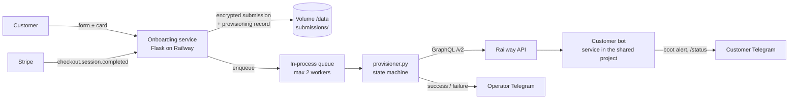
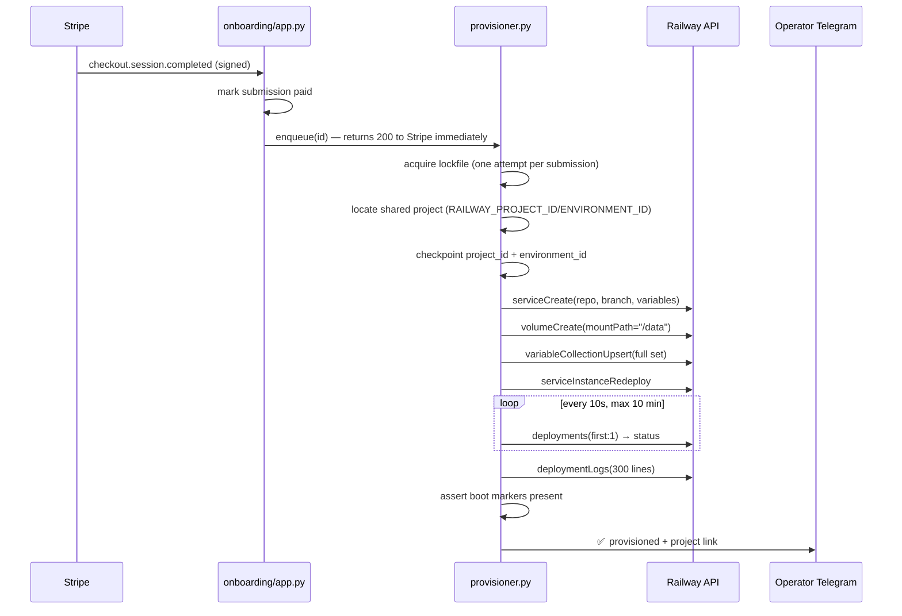

# Automated Provisioning — Zero-Touch Customer Onboarding

This document describes the system that replaces the manual Railway work in
[`ADMINISTRATOR_ONBOARDING.md`](ADMINISTRATOR_ONBOARDING.md). After the one-time
setup below, a paid signup **automatically becomes a running bot** — no Railway
UI, no copy/paste, no manual verification.

What stays exactly the same (by design, out of scope):

- The customer still creates their own **Kalshi account/key** and **Telegram bot**
  (covered by the customer onboarding guide).
- Every bot still starts in **paper mode** (`DEMO_MODE=true`).
- **Going live** (`DEMO_MODE=false`) stays a deliberate manual step (§8 of the runbook).
- One customer = one Railway project = one bot. No multi-tenant supervisor.

---

## 1. How it works

```
Customer completes the onboarding form (+ Stripe Checkout)
  ↓
Stripe webhook: checkout.session.completed  →  submission marked "paid"
  ↓
provisioner.enqueue(id)          (background worker inside the onboarding service)
  ↓
Railway GraphQL API:
  (locate shared project)        → RAILWAY_PROJECT_ID / RAILWAY_ENVIRONMENT_ID of
                                   the onboarding service — the bot is a sibling
                                   service in that project, NOT a new project
  serviceCreate                  → service "<handle>-bot" from the FlipPulse repo,
                                   FULL variable set injected at creation
  volumeCreate                   → volume mounted at /data
  variableCollectionUpsert       → idempotent re-assert of every variable
  serviceInstanceRedeploy        → deploy with everything in place
  deployments (poll)             → wait for SUCCESS (timeout 10 min)
  deploymentLogs                 → require the boot markers:
                                   "✅ RSA private key loaded."
                                   "Sizing (% of balance)"
  ↓
Submission updated: provisioning.status = "provisioned" (+ all Railway ids)
  ↓
Operator Telegram: "✅ FlipPulse bot provisioned … Project: <link>"
```

### Architecture



### Provisioning sequence



---

## 2. One-time setup (~10 minutes, then never again)

1. **Railway API token.** Railway → Account (or Workspace) Settings → **Tokens**
   → create a token. If it's a workspace/team token, also copy the team id.
2. **GitHub app access.** Make sure the Railway account owning the token has the
   Railway GitHub app installed with access to the `FlipPulse` repo (it already
   does if you've ever deployed this repo from that account). This is what lets
   `serviceCreate` point at the repo without any UI.
3. **Set variables on the onboarding service** (the existing Flask signup site):

   | Variable | Required | Value |
   |---|---|---|
   | `RAILWAY_API_TOKEN` | **yes** | The token from step 1. Enables all automation. |
   | `RAILWAY_PROJECT_ID` | auto on Railway | The project customer bots are deployed into (as sibling services). Railway injects this into the onboarding service automatically; set it only when running onboarding outside Railway. |
   | `RAILWAY_ENVIRONMENT_ID` | auto on Railway | The environment within that project (usually `production`). Also injected by Railway automatically. |
   | `AUTO_PROVISION` | no (default `true`) | `false` = webhook only marks paid; you use the `/admin` button or CLI. |
   | `PROVISION_REPO` | no (default `jchristadore-ux/FlipPulse`) | Repo every bot deploys from. |
   | `PROVISION_REPO_BRANCH` | no (default `release`) | Branch customer bots deploy from. Defaults to `release`, NOT `main` — Railway auto-redeploys every tracking service on push, so a fleet on `main` restarts (and can brick) every customer bot on any bad merge. Develop on `main`, keep one in-house canary bot tracking `main`, and promote deliberately with `git push origin main:release`. |
   | `BOT_OPERATOR_CHAT_ID` | recommended | Your Telegram chat id — injected into every bot as `TELEGRAM_OPERATOR_CHAT_ID` (runbook §7 oversight, automated). |
   | `PROVISION_DEPLOY_TIMEOUT` | no (default `600`) | Seconds to wait for a green deploy. |
   | `PROVISION_MAX_CONCURRENCY` | no (default `2`) | Parallel provisioning jobs. |
   | `PROVISION_LOG_MARKERS` | no | Comma-separated boot-log lines required for a green verify. |
4. **Stripe webhook** (you likely have this already): endpoint
   `POST /stripe/webhook`, event `checkout.session.completed`, and
   `STRIPE_WEBHOOK_SECRET` set. This is the trigger for zero-touch provisioning.
5. Redeploy the onboarding service. `GET /healthz` now reports
   `"railway": true, "auto_provision": true`.

**Ready checklist — you are fully automated when:**

- [ ] `/healthz` shows `railway: true` and `auto_provision: true`
- [ ] Stripe webhook delivers `checkout.session.completed` (Stripe dashboard → webhook → 200s)
- [ ] A test signup (Stripe test mode) produces a new service **in the onboarding's own project** with a green deploy
- [ ] The provisioning result arrived on your operator Telegram
- [ ] `/admin` shows the customer as “✅ running” with a working project link
- [ ] You did not open the Railway UI

---

## 3. The runbook, step by step: BEFORE → AFTER

Every section of `ADMINISTRATOR_ONBOARDING.md`, and what replaced it. Nothing
below remains manual.

| § | BEFORE (manual) | AFTER (automated) | Where it runs |
|---|---|---|---|
| §0 | Read the Telegram alert, open `/admin` or `admin_cli.py show`, copy values | Stripe webhook hands the submission id straight to the provisioner; secrets are decrypted in memory | `app.py stripe_webhook` → `provisioner.provision()` |
| §0 | Confirm `payment_status` is `paid` | Provisioning is **gated on paid** (`require_paid=True` on the webhook path); operator button/CLI can override for manually-billed customers | `provisioner.provision()` payment gate |
| §2.1 | Railway UI: New Project → Deploy from GitHub repo → name it | The bot is created as a **sibling service in the onboarding's own project** (via `RAILWAY_PROJECT_ID` / `RAILWAY_ENVIRONMENT_ID`, injected by Railway) — no per-customer project. `serviceCreate` with `source.repo = FlipPulse`, `branch = release` (the pinned fleet branch) | `provisioner.provision()` (locate) + `RailwayClient.service_create` |
| §2.2 | Set Root Directory blank (the make-or-break setting) | `serviceCreate` never sets a root directory, so it's blank **by construction** — the repo-root `railway.toml` (`python bot.py`) always applies. The "empty repo / Bird_Bot" failure mode can no longer happen: the repo is pinned in `PROVISION_REPO` | `RailwayClient.service_create` |
| §2 | Accept the crash-loop until vars are pasted | Gone: the full variable set is passed **inside `serviceCreate`**, so the first build already has its config | `deploy_variables()` inline at creation |
| §3 | UI: Volumes → New Volume → mount `/data` | `volumeCreate(mountPath="/data")` | `RailwayClient.volume_create` |
| §4 | Paste the env block into the Raw Editor, then add the `/data` `*_STATE_PATH` vars from `.env.example` by hand | `deploy_variables()` emits the **complete** set in one shot: customer values, `KALSHI_PRIVATE_KEY_PEM_B64` (single-line, unmanglable), `DEMO_MODE=true`, all seven `/data` paths, `PERF_FEE_PCT=0.0`, and your `TELEGRAM_OPERATOR_CHAT_ID`. Re-asserted with `variableCollectionUpsert` for idempotency | `provisioner.deploy_variables()` |
| §5 | (Customer's BotFather steps) | **Unchanged** — customer-side, and the form already validates token + chat end-to-end at signup | — |
| §6.1 | Click Deploy | `serviceInstanceRedeploy` | `RailwayClient.service_redeploy` |
| §6.2 | Watch the logs for a clean boot | Poll `deployments` until `SUCCESS` (fail on `FAILED/CRASHED`, timeout 10 min), then scan `deploymentLogs` for the runbook's green-verify markers (`✅ RSA private key loaded.`, `Sizing (% of balance)`) | `_wait_for_deployment` + `_verify_boot_logs` |
| §6.3–4 | Send `/status` in Telegram, confirm boot alert | The bot's own boot alert goes to the customer (and to you via `TELEGRAM_OPERATOR_CHAT_ID`, which is now injected automatically); provisioning success/failure lands on operator Telegram with the project link | bot + `_notify_operator` |
| §7 | Remember to set `TELEGRAM_OPERATOR_CHAT_ID` per customer | Set `BOT_OPERATOR_CHAT_ID` **once** on the onboarding service; every provisioned bot gets it | `deploy_variables()` |
| §8 | Going live | **Still manual, on purpose** (flip `DEMO_MODE=false` after confirming funding) | — |
| §9 | Stripe products/webhook | Unchanged (already automated); the webhook now *also* triggers provisioning | `app.py` |
| Troubleshooting: truncated PEM | Re-paste the B64 line | Can't occur: the key goes API-to-API as one base64 line, never through a clipboard | — |

**Required credentials, in one place:** `RAILWAY_API_TOKEN`,
`ONBOARDING_FERNET_KEY` (already required), `STRIPE_WEBHOOK_SECRET` (already
recommended). `RAILWAY_PROJECT_ID` / `RAILWAY_ENVIRONMENT_ID` are injected by
Railway automatically — no new secret types.

---

## 4. Why this stack (and not something else)

**Railway API vs CLI.** The **GraphQL API** (`backboard.railway.app/graphql/v2`)
is used for everything: it's callable from the already-deployed Flask service,
returns structured ids/statuses to checkpoint, and needs no Railway CLI binary,
no interactive login, no shell-out parsing. The CLI is a wrapper over the same
API and adds nothing here. Terraform was rejected: a Railway provider exists,
but per-customer `terraform apply` from a webhook means managing state files
per customer — far heavier than a 6-step state machine.

**Orchestration layer.** Compared:

| Option | Verdict |
|---|---|
| **In-process worker in the onboarding service** | **Chosen.** The Flask app already holds the Fernet key, the submissions, and the Stripe webhook. Zero new services, zero new secrets distribution, one deploy. At your scale (single-digit signups/day, ~6 API calls + a poll loop per signup) a queue service is overhead, not safety. |
| GitHub Actions | Wrong trigger surface (webhook → repo_dispatch hop), and secrets would have to be mirrored into GitHub. Good for CI, awkward for customer provisioning. |
| n8n / Trigger.dev | Another always-on service to host, secure, and hand the Fernet key to. Buys a UI you don't need. |
| Temporal | Built for fleets of long workflows. Unjustified below hundreds of signups/day. |

**Golden template.** The repo **is** the golden template: every service points
at `PROVISION_REPO@PROVISION_REPO_BRANCH`. Versioning deployments = git. The
fleet branch is `release`: Railway auto-redeploys every tracking service on
push, so customer bots must never track `main` directly — one bad merge would
restart/brick all of them at once. Develop on `main` (with one in-house canary
bot tracking it), then promote deliberately once the canary has traded through
a session:

```bash
git push origin main:release        # promote main → the customer fleet
```

To canary a customer on a branch, set `PROVISION_REPO_BRANCH` before provisioning
(or change the branch in Railway later). Per-customer repo clones were
explicitly rejected — the runbook already warns that pattern causes the
"Connected branch does not exist" failure; multi-tenant single-box was rejected
because per-customer project isolation (crash blast radius, per-customer
volume, per-customer logs) is a feature, not overhead.

---

## 5. Failure handling & recovery

Core rule: **every step checkpoints its Railway ids into the submission file
before moving on**, so any retry *resumes* instead of duplicating. A failed
provision never auto-deletes anything — partial state is kept for inspection,
and cleanup is an explicit operator command.

| Failure | Detected by | What happens | Recovery |
|---|---|---|---|
| Railway API 429/5xx/network | HTTP layer | Retried in-place, 4 tries, backoff 2s/4s/8s | Automatic |
| Shared project ids missing | `locate_project` guard | Status `failed@locate_project`, operator alerted | Set `RAILWAY_PROJECT_ID`/`RAILWAY_ENVIRONMENT_ID` (Railway injects them on-platform) and retry |
| `serviceCreate` fails | GraphQL error | Shared project id already checkpointed | Retry reuses the project, creates only the service |
| Volume / variables fail | GraphQL error | Ids so far checkpointed | Retry skips the service, resumes at volume |
| Deployment `FAILED`/`CRASHED` | Status poll | Fails with the last 5 log lines in the alert | Fix cause (usually a bad customer key → have them rotate + resubmit), then retry |
| Deployment hangs | 10-min timeout | `failed@deploy` with last status | Retry (it just redeploys and re-polls) |
| Boot markers missing | Log scan | `failed@verify` — deploy is green but the bot didn't prove Kalshi auth | Inspect service logs via the alert's project link, retry after fix |
| Double trigger (Stripe retries webhooks!) | `O_EXCL` lockfile + status check | Second attempt refuses: "already in progress"; already-provisioned submissions are a **no-op** | Automatic (idempotency) |
| Worker/process dies mid-run | Lockfile staleness (45 min) | Lock expires; submission still shows its last checkpoint | Retry resumes |
| Service restarts with jobs queued (queue is in-memory; Stripe won't retry an acknowledged event) | **Boot sweep** (`reconcile_pending()` on app start) | Every *paid* submission whose provisioning never finished (never attempted, `failed`, or `in_progress` with a stale checkpoint) is re-enqueued; operator gets one summary alert. `deprovisioned` customers are never resurrected | Automatic |
| Operator wants it gone | — | `python admin_cli.py deprovision <id>` — confirms by handle, deletes only that bot's **service** (never the shared project) | Explicit only |

**Retry surfaces** (all resume from the last checkpoint, all safe to repeat):
the **`↻ Retry provisioning`** button on `/admin/<id>`, or
`python admin_cli.py provision <id>`. Alerting is operator-Telegram (the same
channel you already watch); every failure message names the step, the error,
and the retry command.

---

## 6. Security model

| Secret | At rest | In flight | Notes |
|---|---|---|---|
| Kalshi key id + PEM, customer bot token | Fernet-encrypted in the submission file (`chmod 600`, on the service volume) — unchanged | Decrypted **in memory only**, sent once to Railway's variables API over TLS | Never logged, never in Telegram, never in checkpoint records (checkpoints store only variable **names** and Railway ids) |
| `RAILWAY_API_TOKEN` | Railway variable on the onboarding service only | Bearer header to Railway | Scope it to the workspace that holds customer projects; rotate like any credential. It is the blast-radius secret — it can delete projects — which is why `deprovision` is CLI-only with a typed confirmation |
| `ONBOARDING_FERNET_KEY` | Already required by the form | — | Unchanged |
| `STRIPE_WEBHOOK_SECRET` | Railway variable | Verifies webhook signatures | Provisioning can only be triggered by a **signed** Stripe event, the token-gated admin page, or the CLI |

**Isolation between customers** is structural: each customer gets their own
Railway project, service, volume, and variable set; a compromised or crashing
bot can't see another customer's keys. **Audit trail:** every submission file
carries its full `provisioning` record (steps, ids, timestamps, errors), and
every attempt/result lands on operator Telegram.

---

## 7. Scalability

Per signup: ~6 GraphQL mutations + one status poll every 10s for a few minutes.

| Load | Behavior |
|---|---|
| 1/day (today) | One worker does everything in ~1–3 min (dominated by Railway build time, not this system) |
| 10/day | Nothing changes; queue is empty almost always |
| 50/day | Still trivial (~300 mutations/day). Bump `PROVISION_MAX_CONCURRENCY` to 3–4 if you want faster bursts |
| 100+ burst | The queue absorbs it: concurrency is capped (default 2), so Railway sees a bounded, polite request rate; HTTP-level backoff handles any 429s; per-submission locks + resume make a retry storm impossible (a retry never duplicates work). A 100-burst drains in roughly 100 × build-time ÷ concurrency — raise concurrency before a launch spike |

The real ceiling is Railway build minutes and per-workspace project counts —
both billing-plan questions, not architecture questions. If you ever outgrow
the in-process queue (webhook volume >> minutes-long jobs), the seam is clean:
`enqueue()` is the only integration point; swap its body for a real queue
without touching the state machine.

Note: the onboarding service runs gunicorn's default single worker, which is
what makes the in-process queue safe. If you ever add `-w N`, the lockfile
still guarantees correctness (no duplicate provisioning) — you'd just have N
independent queues, which is fine.

---

## 8. Operator quick reference

```bash
# See everything (list now shows bot status alongside payment)
https://<onboarding-host>/admin?token=<ADMIN_TOKEN>

# CLI equivalents (run with the onboarding service's env)
python admin_cli.py list
python admin_cli.py status      <id>     # provisioning record + project link
python admin_cli.py provision   <id>     # provision or resume; skips paid gate
python admin_cli.py deprovision <id>     # DELETE the customer's Railway project
```

Day-to-day, the loop is: **signup alert → (nothing) → "✅ provisioned" alert.**
You only act on a ❌, and the ❌ tells you the step, the error, and the retry
command. Going live for a customer remains: Railway variables →
`DEMO_MODE=false` → redeploy → `/status` shows live (runbook §8) — or ask for
that to be automated behind an explicit command next.
