# FlipPulse Setup Guide

**Welcome!** This guide walks you through everything you need to do before your
FlipPulse trading bot can start working for you. It's written for people with
**zero technical experience** — every step has a picture, and nothing is
assumed.

> ⏱ **Time needed:** about **10–15 minutes**.
> ✅ **You only do this once.**
> 💬 **Stuck?** Jump to the [FAQ](#faq) or [Troubleshooting](#troubleshooting) at the bottom — almost every question is answered there.

By the end you will have collected **four things** that you'll paste into our
onboarding form at the very end:

| # | What you'll collect | Where it comes from |
|---|---|---|
| 1 | **Kalshi API Key ID** | Kalshi website (Section 2) |
| 2 | **Kalshi PEM file** | Kalshi website (Section 2) |
| 3 | **Telegram Bot Token** | BotFather in Telegram (Section 6) |
| 4 | **Telegram Chat ID** | @userinfobot in Telegram (Section 9) |

Keep a note open (or use the [printable checklist](checklist.html)) and paste
each item in as you go. That's the whole trick — collect four things, hand them
to us, and the bot does the rest.

---

## The 4 things, and what they do

Before we start, here's the plain-English version of *why* you're collecting
these — it makes every step make sense:

- **Kalshi** is the regulated exchange where the trades actually happen. You
  need an account there and an **API key** — think of it as a special password
  that lets *your* FlipPulse bot place trades on *your* account (and nothing
  else). The **PEM file** is the secret half of that key.
- **Telegram** is a free messaging app. Your bot uses it to **text you**
  updates — when it starts, wins, loses, and a daily summary. The **Bot Token**
  lets us create your personal alert bot; the **Chat ID** tells it which
  conversation is yours.

> 🔒 **Your money never touches us.** Funds stay in *your* Kalshi account. The
> API key only lets the bot trade; it can't withdraw. We bill the subscription
> separately through Stripe.

---

# Section 1 — Create a Kalshi Account

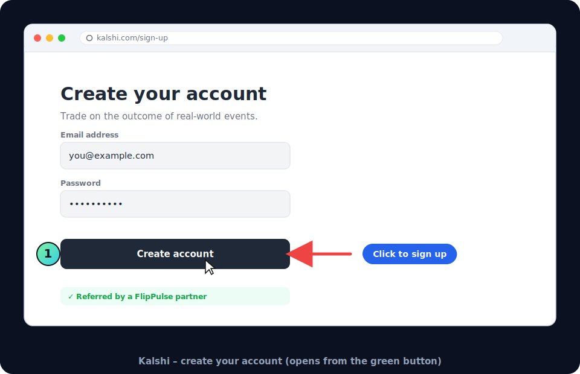

1. Open the **Create Your Kalshi Account** button (it's on the
   [start page](index.html), or use your FlipPulse welcome email link).
2. Enter your **email address** and choose a **password**.
3. Click **Create account**.

> ℹ️ **Use our link.** Opening Kalshi from the FlipPulse button makes sure your
> account is tagged to us so we can support you. If you already have a Kalshi
> account, that's fine — just log in and skip to [Section 2](#section-2--generate-kalshi-api-credentials).

### Verify your email

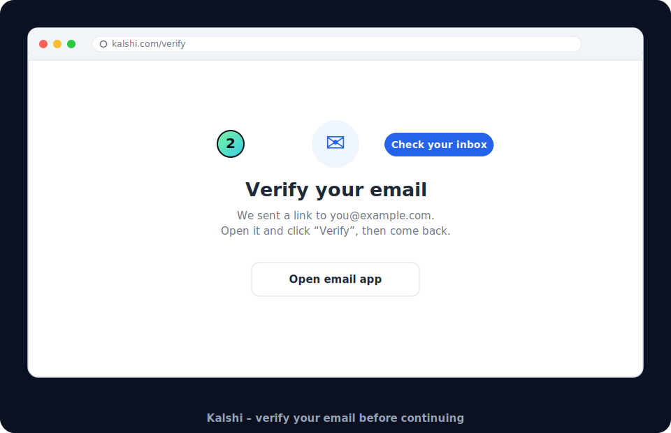

4. Kalshi sends you a **verification email**. Open your inbox, find the message
   from Kalshi, and click the **verify** link inside it.

> ✅ **What you should see:** a "your email is verified" confirmation, then you
> land back on Kalshi, logged in.

### Identity verification (if asked)

5. To trade real money, Kalshi (like any regulated US exchange) may ask you to
   confirm your identity — usually your **name, date of birth, and the last 4
   digits of your SSN**. Follow the on-screen prompts. This is Kalshi's process,
   not ours, and it's normal.

> ℹ️ You can finish this whole guide even if identity verification is still
> "pending." You only need it approved before you fund the account and go live —
> which is a later, separate step.

### Log in

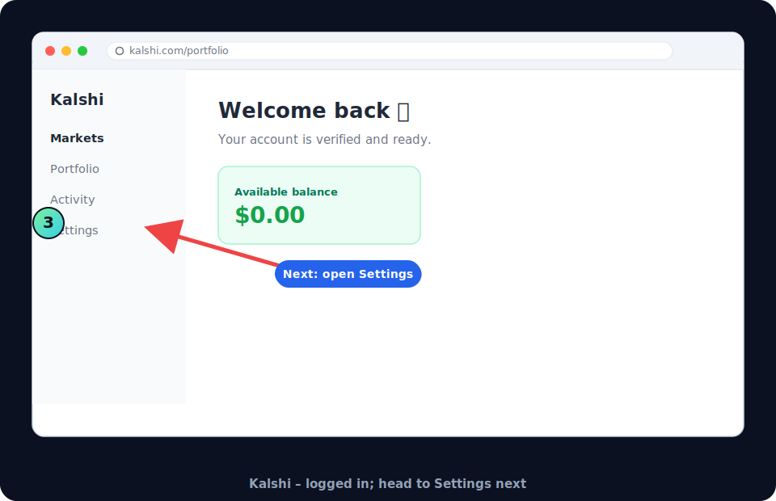

6. Once verified, you'll see your Kalshi **dashboard**. That's it for Section 1.

> ✅ **What you should see:** the Kalshi dashboard with your balance (probably
> $0.00 for now — funding comes later).

---

# Section 2 — Generate Kalshi API Credentials

This is the most important section. Take it slowly — the two items you collect
here (the **Key ID** and the **PEM file**) are what let your bot trade.

### Open API settings

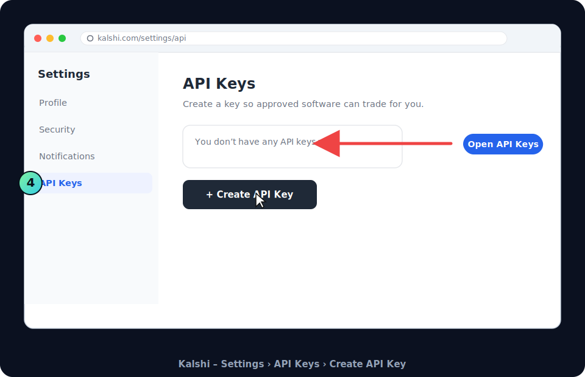

1. Click **Settings** (or your profile menu), then find **API Keys**.
2. Click **Create API Key**.

> 💡 **Can't find it?** The API section is sometimes under **Settings →
> Security → API** or a menu called **"Developers"** / **"API Access."** Look
> for the word **API**. See troubleshooting below if you're stuck.

### Name and create the key

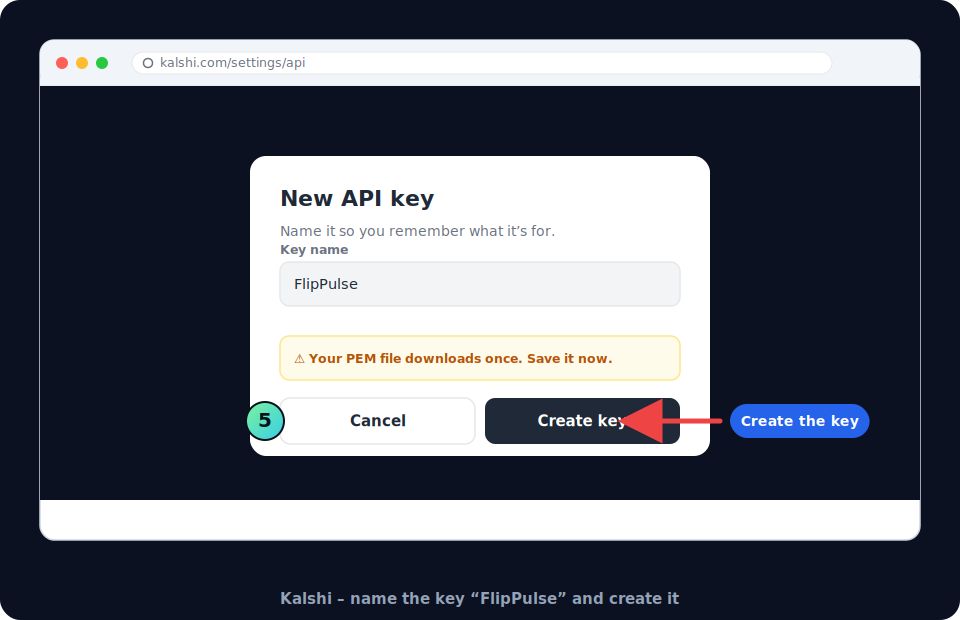

3. Give the key a name you'll recognise — we suggest **`FlipPulse`**.
4. Click **Create key**.

### Copy the Key ID and download the PEM


5. **Copy the API Key ID.** It's a long code that looks like
   `a1b2c3d4-0000-4e5f-9a8b-1234567890ab`. Click **Copy** and paste it into
   your note. This is **Thing #1**.
6. **Download the PEM file.** Click the **Download** button. A file named
   something like `kalshi-flippulse.pem` saves to your computer's **Downloads**
   folder. This is **Thing #2**.

> 🔴 **CRITICAL — the PEM downloads only once.** Kalshi shows you the private
> key a single time. If you close this page without downloading, you can't get
> the same key back — you'd just make a new one. Download it **now**.

### Save the PEM safely

7. Move the PEM file somewhere you'll find it (e.g., a folder called
   `FlipPulse`). **Do not:**
   - ❌ rename the file's contents or retype it,
   - ❌ open it in Word/Notes and "save as" (that can corrupt it),
   - ❌ copy-paste the text out of it.

   You'll simply **upload the file as-is** in the final form. Treat it like a
   key to your house.

> ✅ **What you should see:** the Key ID copied into your note, and a
> `.pem` file sitting in your Downloads folder.

### Section 2 troubleshooting

| Problem | Fix |
|---|---|
| **Can't find API settings** | Look under **Settings → Security**, or search the page for "API". On mobile, use the Kalshi **website in a browser** rather than the app — API keys are easier to create there. |
| **PEM won't download** | Try a different browser (Chrome, Edge, Safari, Firefox). Make sure pop-up/download blocking is off for kalshi.com. |
| **Browser blocked the download** | Look for a small "download blocked" icon in your browser's address bar and click **Keep / Allow**. Then click Download again. |
| **I lost my PEM file** | You can't re-download the same one. Just **create a new API key** (repeat this section) and use the new Key ID + new PEM. Delete the old key if you like. |
| **I made several API keys** | No harm done. Just make sure the **Key ID you copy** matches the **PEM you downloaded** from the *same* key. When in doubt, create one fresh key and use only that pair. |

---

# Section 3 — Install Telegram

Telegram is the free app your bot uses to text you. Install it on whichever
device you'll want alerts on (phone is most popular; desktop also works).

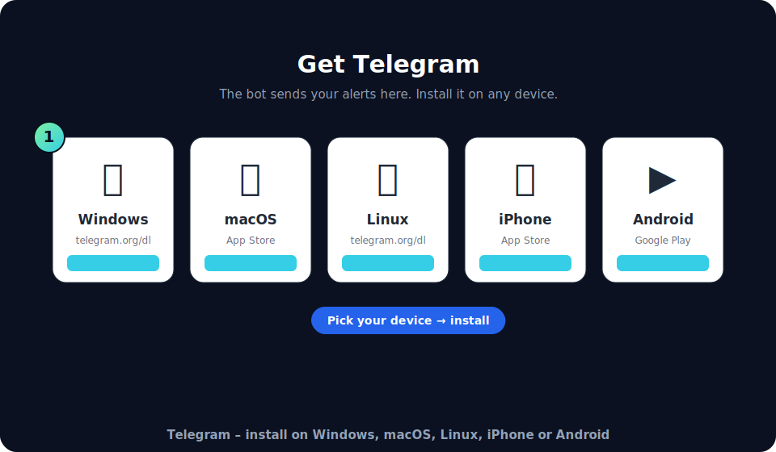

### Desktop

- **Windows:** download from **https://telegram.org/dl/desktop/win64**, run the
  installer, click through **Next → Install → Finish**.
- **macOS:** get **Telegram** from the **Mac App Store**
  (https://apps.apple.com/app/telegram/id747648890), or
  **https://telegram.org/dl/macos**. Drag it to Applications and open it.

### Mobile

- **iPhone:** open the **App Store**, search **Telegram**, tap **Get**
  (https://apps.apple.com/app/telegram-messenger/id686449807).
- **Android:** open the **Google Play Store**, search **Telegram**, tap
  **Install**
  (https://play.google.com/store/apps/details?id=org.telegram.messenger).

### Set up your Telegram account

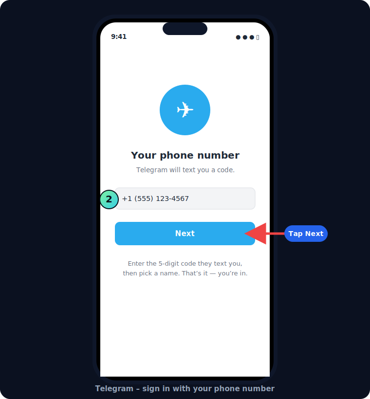

1. Open Telegram and tap **Start Messaging**.
2. Enter your **phone number**; Telegram texts you a **5-digit code**.
3. Type the code, add your **first name**, and you're in.

> 🟡 **Get the real Telegram.** There are copycat apps. The genuine one is by
> **"Telegram FZ-LLC"** and has a **blue paper-plane** icon. If you installed
> the wrong one, delete it and use the official links above.

> ✅ **What you should see:** the Telegram home screen with a search bar at the
> top.

---

# Section 4 — Create Your Telegram Bot

Now you'll create your personal alert bot by chatting with Telegram's official
"bot-making" bot, called **BotFather**.

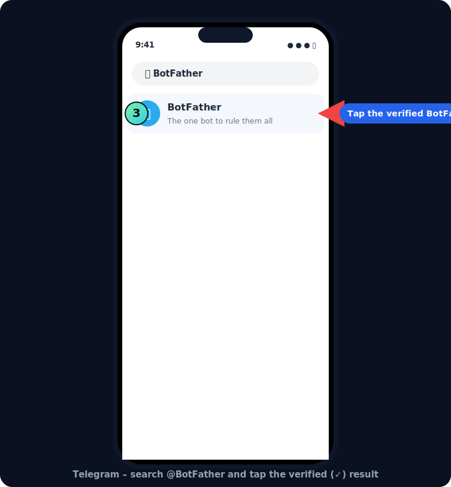

1. Tap the **search bar** at the top of Telegram and type **`BotFather`**.
2. In the results, tap **BotFather** — the one with the **blue verified check
   (✓)** next to its name. (There are fakes; the checkmark is how you spot the
   real one.)

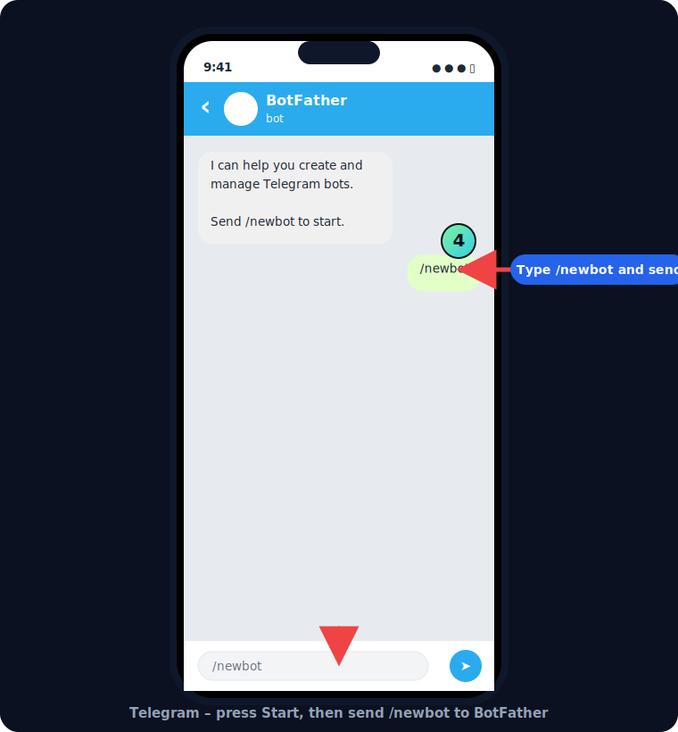

3. Tap **Start** (or the **START** button at the bottom).
4. In the message box at the bottom, type **`/newbot`** exactly, and send it.

> 💡 **Where do I type?** The **message box** is the long bar at the very bottom
> of the chat, the same place you'd type "hello" to a friend. Type `/newbot`
> there and press send (the ➤ arrow).

---

# Section 5 — Name Your Bot

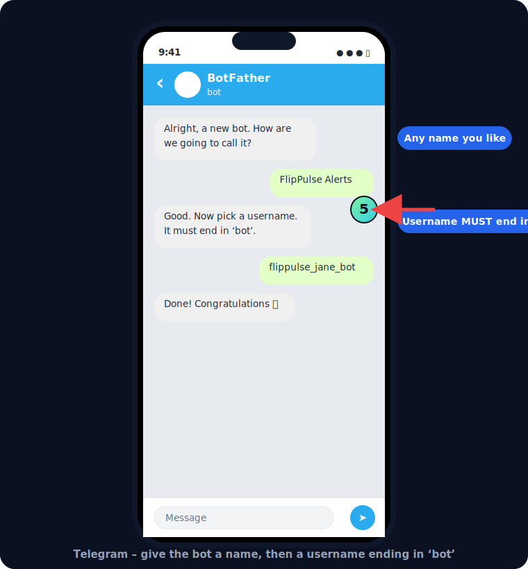

BotFather now asks two quick questions:

1. **Bot name** — a friendly label. Anything is fine, e.g. **`FlipPulse
   Alerts`**. Type it and send.
2. **Bot username** — a unique @handle. It **must end in `bot`** and can't
   contain spaces.

**Valid usernames** ✅
- `flippulse_jane_bot`
- `janes_flippulse_bot`
- `jane2026alertsbot`

**Invalid usernames** ❌
- `flippulse_jane` — doesn't end in `bot`
- `FlipPulse Jane bot` — has spaces
- `flippulse_bot` — almost certainly already taken

> 💡 **"Sorry, this username is already taken."** Totally normal — just add
> numbers or your name until it's accepted, e.g. `flippulse_jane_8391_bot`.

---

# Section 6 — Copy the Bot Token

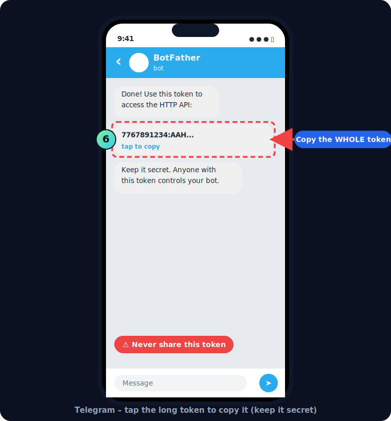

When the username is accepted, BotFather replies **"Done! Congratulations"** and
shows you a **token** — a long code like:

```
7767891234:AAHk9s_ExampleTokenDoNotShareThisWithAnyone
```

1. **Tap the token once** — Telegram copies it for you (it may say "copied").
   On desktop, select the whole line and press **Ctrl+C** (Windows) or
   **⌘+C** (Mac).
2. Paste it straight into your note. This is **Thing #3**.

> 🔴 **Never share your bot token with anyone.** Anyone who has it can control
> your alert bot. We only ask for it inside the secure onboarding form. FlipPulse
> staff will **never** ask for it by email, text, or phone.

> ✅ **What you should see:** the full token — a number, then a colon `:`, then
> a long string of letters — sitting in your note. Make sure you copied the
> **whole thing**, including the part after the colon.

---

# Section 7 — Open Your Bot

Now open the bot you just made (this is **your** bot, not BotFather).

1. In BotFather's message, there's a link like **`t.me/flippulse_jane_bot`** —
   **tap it** to open your bot. **Or**, tap the search bar and type your bot's
   username to find it.
2. You'll land in a fresh, empty chat with your bot at the top.

> 💡 **Make sure it's the right chat.** The name at the top should be **your
> bot's name** (e.g. "FlipPulse Alerts"), not "BotFather."

---

# Section 8 — Click Start

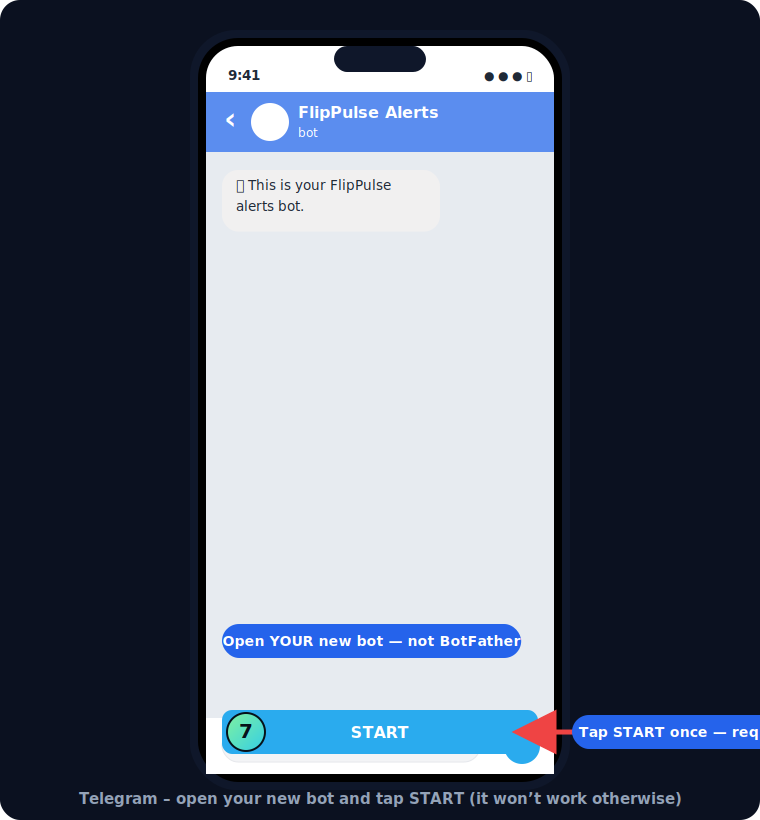

At the bottom of your bot's chat there's a big **START** button.

1. **Tap START.**

> 🔴 **This step is required.** Telegram blocks bots from messaging you until
> **you** press Start first. If you skip this, your bot simply won't be able to
> send you alerts — even though everything else is set up correctly.

> ✅ **What you should see:** the START button disappears and the chat becomes a
> normal message box. That's the sign it worked.

---

# Section 9 — Get Your Telegram Chat ID

Last thing to collect! Your **Chat ID** is a number that tells the bot which
conversation is yours. You get it from another official helper bot,
**@userinfobot**.

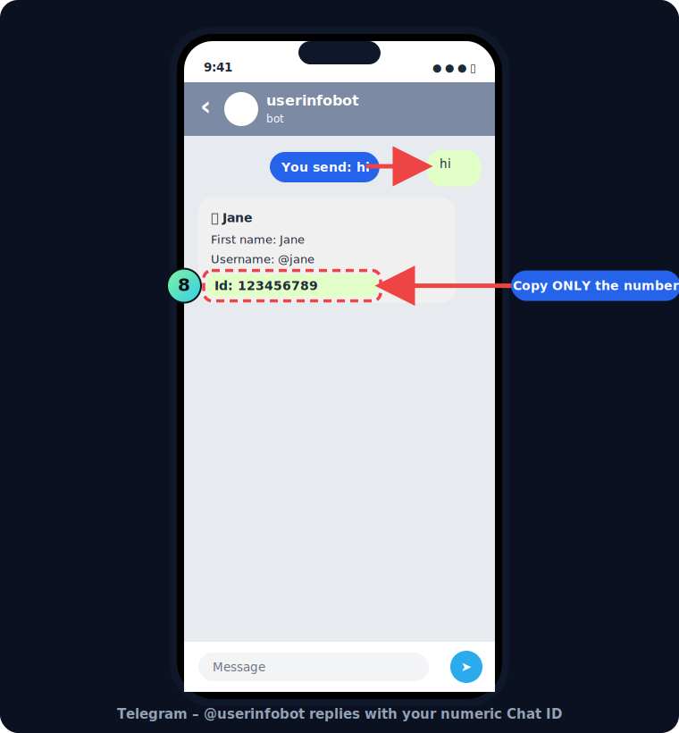

1. Tap the **search bar** and type **`userinfobot`**.
2. Open **@userinfobot** from the results.
3. Tap **Start**.
4. Send the message **`hi`** (any message works).
5. It replies instantly with your details. Find the line that says **`Id:`**
   followed by a number, e.g. **`Id: 123456789`**.
6. **Copy only the number** (not the word "Id" or the colon). This is
   **Thing #4**.

> ✅ **What you should see:** a reply from userinfobot containing **`Id:`** and a
> number that's usually 8–10 digits long. Copy just the digits.

> 💡 **Numbers only.** The Chat ID is only digits (sometimes with a leading
> minus sign for groups). If you copied any letters, you grabbed the wrong part
> — copy just the number after `Id:`.

---

# Section 10 — Complete the Customer Onboarding Form

🎉 **You did it!** You should now have all four items in your note:

- [ ] **Kalshi API Key ID** (Section 2)
- [ ] **Kalshi PEM file** (in your Downloads folder, Section 2)
- [ ] **Telegram Bot Token** (Section 6)
- [ ] **Telegram Chat ID** (Section 9)

**Now open the [Customer Onboarding Form](/)** and paste each item into its box,
and upload the PEM file. Submit, complete the quick checkout, and you're done —
we handle everything else automatically from there.

> ✅ **After you submit:** you'll get a confirmation, and your bot is set up in
> **paper mode** (practice mode with fake money) first, so you can watch it work
> risk-free before ever going live.

---

<a name="faq"></a>
# FAQ

**I lost my PEM file. What now?**
No problem — the PEM can't be re-downloaded, but you can make a new key in 60
seconds. Go back to Kalshi → Settings → API Keys → **Create API Key**, download
the new PEM, and copy the new Key ID. Use that new pair. You can delete the old
key.

**I can't find the API settings on Kalshi.**
Use the Kalshi **website in a normal browser** (not the phone app) — it's much
easier there. Look under **Settings**, then **Security** or **API**. Search the
page for the word "API."

**My bot token isn't working / the bot never messages me.**
Two usual causes: (1) you didn't press **START** in your bot's chat (Section 8)
— open your bot and tap Start; or (2) the token was copied incompletely. Re-copy
the **entire** token from BotFather, including everything after the colon `:`.
You can ask BotFather for it again with `/mybots` → your bot → **API Token**.

**I don't see the Start button.**
If the chat already shows a normal message box, you (or Telegram) already
started it — you're fine. If you're unsure, type `/start` in the message box and
send it; that does the same thing.

**@BotFather isn't responding.**
Make sure you opened the **verified** BotFather (blue ✓). Send `/start` again. If
it's still silent, close and reopen Telegram, check your internet connection, and
retry. Avoid look-alike bots without the checkmark.

**@userinfobot isn't responding.**
Confirm you opened **@userinfobot** (that exact spelling), tapped **Start**, and
sent a message like `hi`. If nothing comes back, reopen Telegram and try once
more. An alternative helper bot is **@getidsbot** if userinfobot is ever down.

**I accidentally created two bots.**
Harmless. Just decide which one you'll use, and copy **that** bot's token
(BotFather → `/mybots` → pick the bot → **API Token**). You can delete the extra
with BotFather → `/deletebot` if you want to tidy up.

**I downloaded the wrong Telegram app.**
Delete it and reinstall the **official** Telegram (blue paper-plane icon, by
"Telegram FZ-LLC") using the links in Section 3.

**My Chat ID isn't appearing.**
Make sure you **sent a message** to @userinfobot (like `hi`) after tapping
Start — it only replies once you message it. The ID is the number on the `Id:`
line. If you see letters, you copied the wrong part; copy just the digits.

**Is my money safe? What can the API key do?**
The key only lets your bot **place trades on your own Kalshi account**. It
**cannot withdraw** your funds. Your money stays in your Kalshi account the
whole time.

**Do I need to fund my Kalshi account now?**
No. You can complete setup and watch the bot in **paper mode** (fake money)
first. Funding and going live are separate steps you choose later.

---

<a name="troubleshooting"></a>
# Troubleshooting — quick reference

| Symptom | Most likely cause | Do this |
|---|---|---|
| Kalshi won't let me create an API key | Using the mobile app | Open **kalshi.com in a browser** and try Settings → API |
| PEM file didn't download | Browser blocked it | Allow downloads/pop-ups for kalshi.com, or switch browsers, then Download again |
| Lost the PEM | It only downloads once | **Create a new API key** and use the new PEM + Key ID |
| Not sure which Key ID matches my PEM | Multiple keys made | Create **one fresh key** and use only that pair |
| Installed a fake Telegram | Copycat app | Reinstall the **official** app (blue plane, Telegram FZ-LLC) |
| Can't find BotFather / it's silent | Opened a fake, or connection | Open the **✓ verified** BotFather; send `/start`; check internet |
| "Username already taken" | Popular name | Add numbers/your name until accepted; must end in `bot` |
| Bot never texts me | Didn't press START | Open **your** bot, tap **START** (or send `/start`) |
| Token "invalid" | Copied partially | Re-copy the **whole** token (BotFather → `/mybots` → API Token) |
| No Chat ID shown | Didn't message userinfobot | Tap **Start**, send `hi`, read the `Id:` number |
| Chat ID has letters in it | Copied the wrong line | Copy **only the digits** after `Id:` |

**Still stuck after trying the above?** Send us a message with (a) which
Section number you're on and (b) a screenshot of what you see. We'll get you
sorted — but if you've followed the pictures here, you almost certainly won't
need to.

---

*Your keys and token are transmitted over a secure (HTTPS) connection, encrypted
at rest, and never shared. Funds always remain in your own Kalshi account.*
